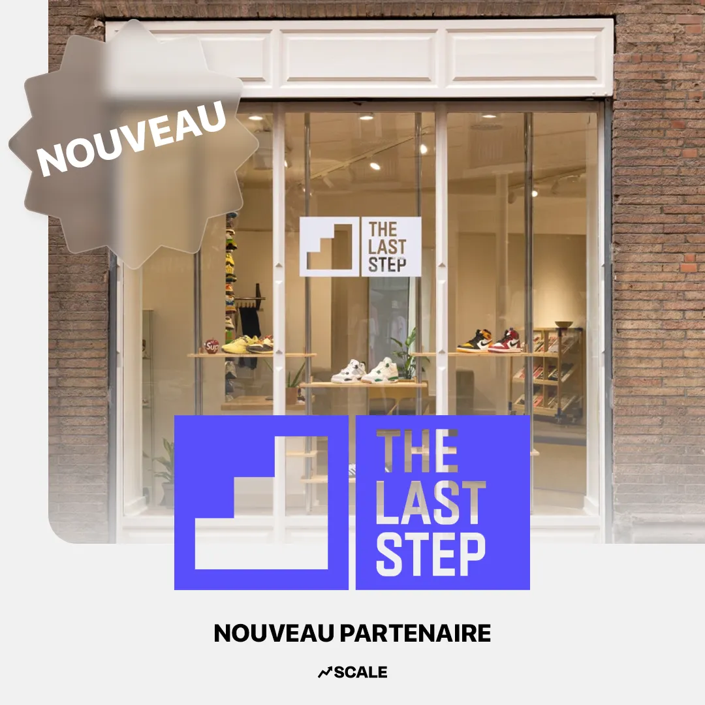
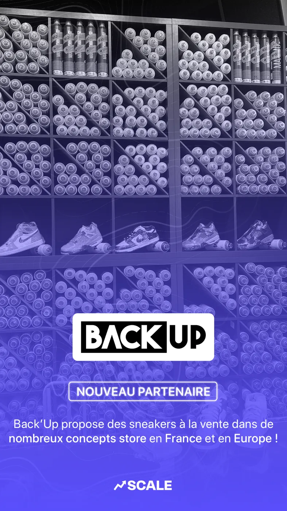
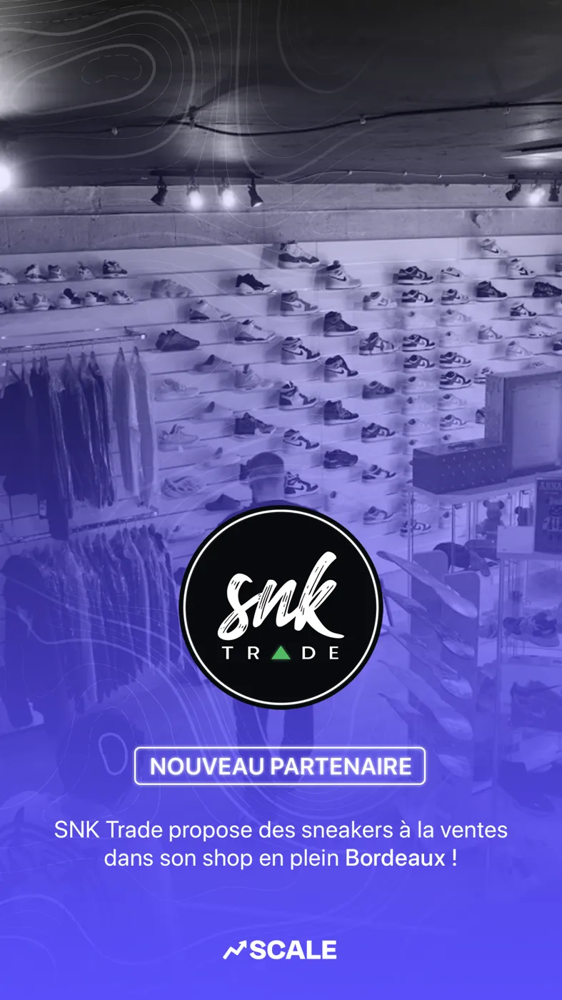
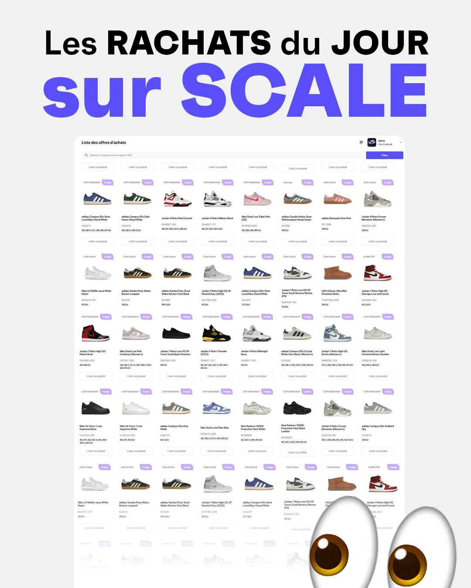
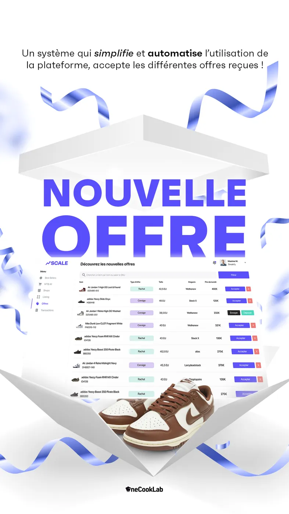

# Communication et réseaux sociaux

La communication de Scale suivait trois rendez-vous réguliers.

## 1. Les nouveaux partenaires

Chaque magasin signé était annoncé en post et en story.

| | | |
| --- | --- | --- |
|  |  |  |

## 2. Les rachats du jour

Un point quotidien sur les offres de rachat disponibles, pour donner envie aux membres d'ouvrir l'application.

## 3. Les nouvelles offres

Des bannières et des stories pour mettre en avant les meilleures offres.

## Les autres canaux

* **Discord** : animation de la communauté de vendeurs
* **Newsletters** marketing
* **Vidéos** au format réseaux sociaux (voir [Ressources](ressources.md))
