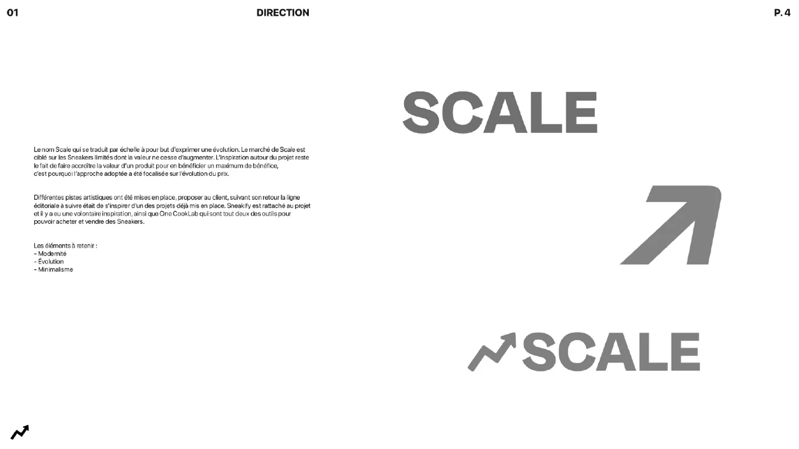
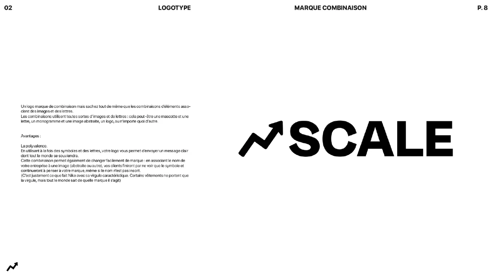
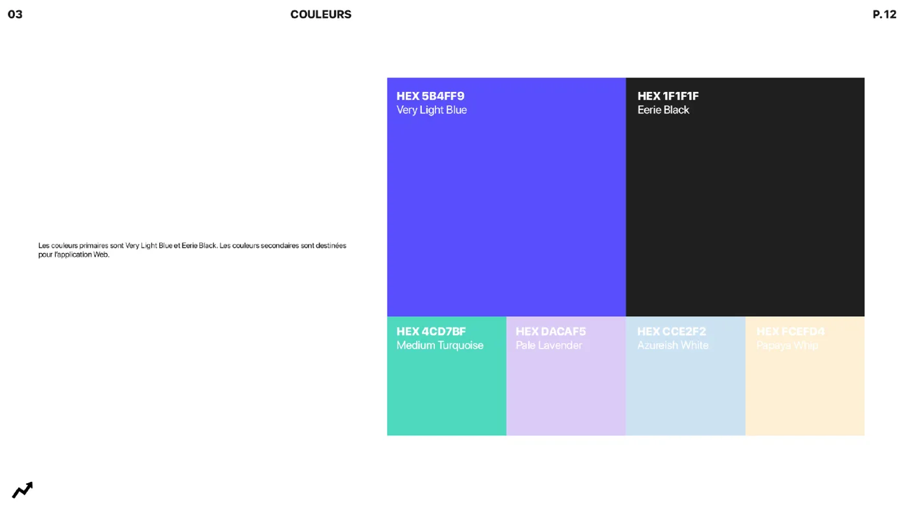
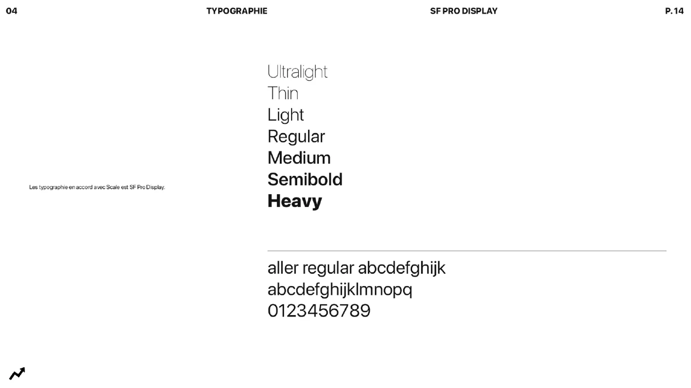
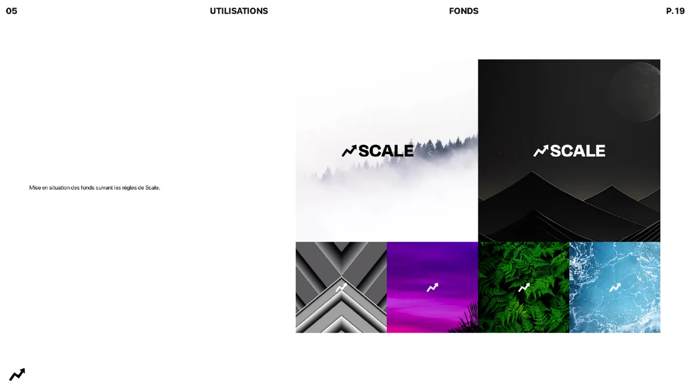
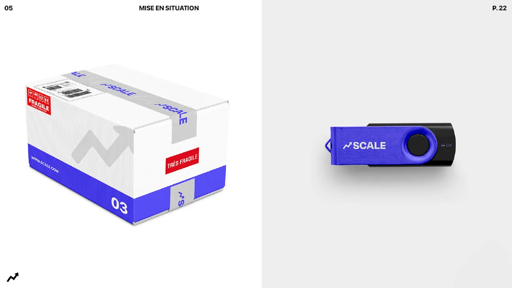

# Identité visuelle

La charte graphique 2023 définit l'image de Scale.

## Les mots-clés

* **Modernité**
* **Évolution**
* **Minimalisme**

La direction s'inspire des projets déjà existants de Sneakify et One CookLab, deux outils pour acheter et vendre des sneakers.

## Le logo

Une flèche qui monte en zigzag, comme une courbe de prix, associée au mot SCALE.

## Les couleurs

| Couleur | Code | Usage |
| --- | --- | --- |
| Very Light Blue | `#5B4FF9` | Couleur principale |
| Eerie Black | `#1F1F1F` | Couleur principale |
| Medium Turquoise | `#4CD7BF` | Couleur secondaire |
| Pale Lavender | `#DACAF5` | Couleur secondaire |
| Azureish White | `#CCE2F2` | Couleur secondaire |
| Papaya Whip | `#FCEFD4` | Couleur secondaire |

## La typographie

**SF Pro Display**, de Ultralight à Heavy.

## Mises en situation


Charte réalisée par SKO Conseil. Le PDF complet (23 pages) est dans [Ressources](ressources.md).

