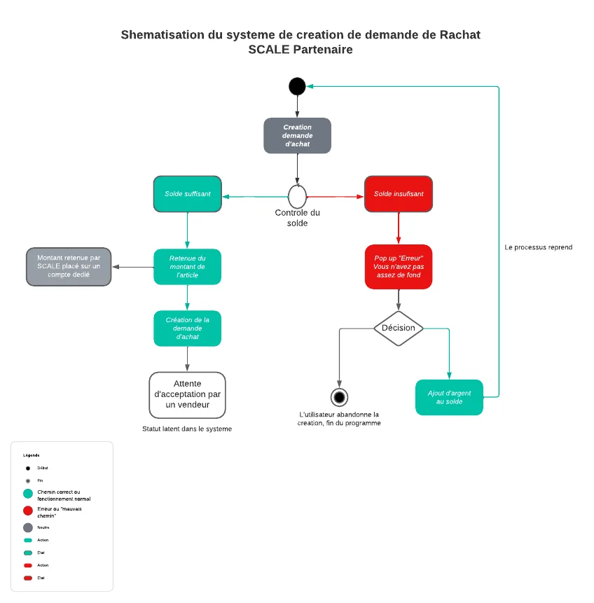
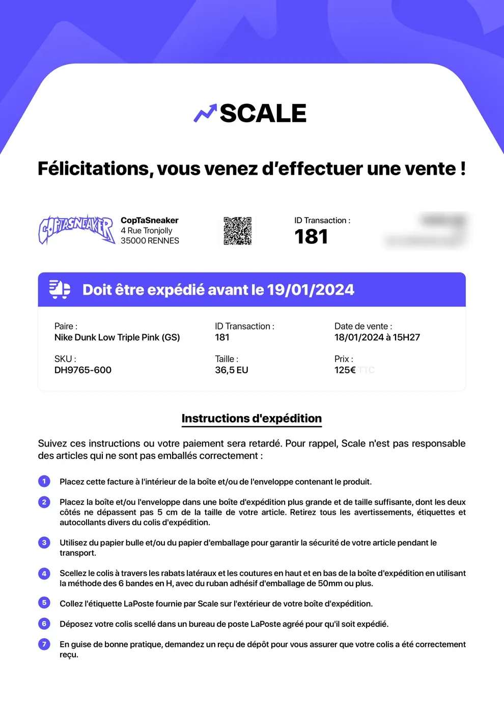
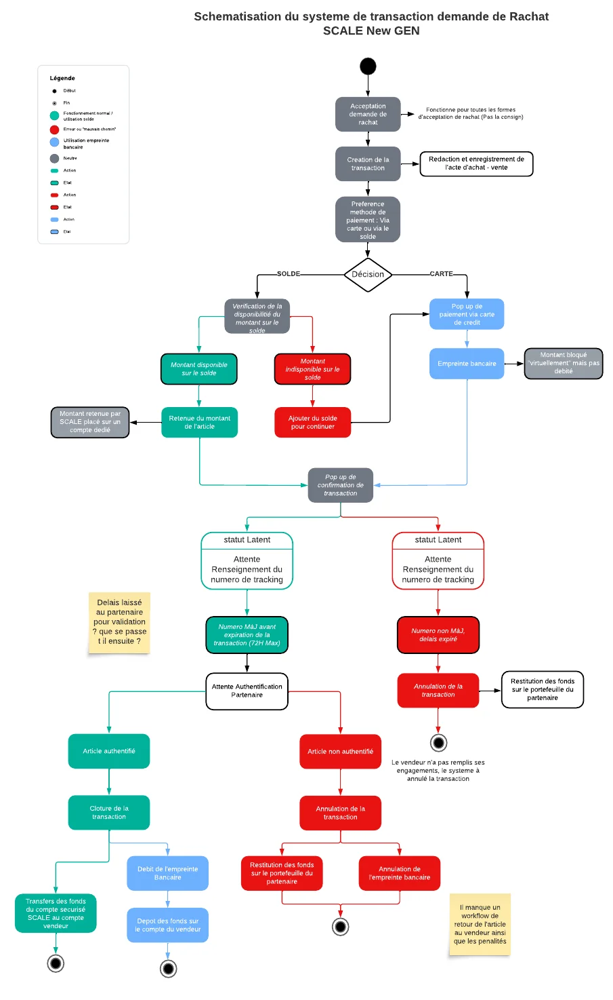

# Le parcours d'une transaction

## 1. Le magasin crée une demande

Avant de publier une demande de rachat, Scale vérifie que le magasin a assez d'argent sur son portefeuille.

* **Solde suffisant :** le montant est bloqué sur un compte dédié. La demande est publiée et attend qu'un vendeur l'accepte.
* **Solde insuffisant :** un message l'invite à recharger son portefeuille avant de continuer.

## 2. Le vendeur accepte

Quand un vendeur accepte, Scale crée la transaction et rédige l'acte d'achat-vente. Le magasin paie avec son solde ou par carte bancaire (empreinte bancaire : le montant est réservé mais pas encore débité).

## 3. L'expédition

Le vendeur reçoit une confirmation de vente avec la date limite d'envoi et les instructions d'emballage.

* Il a **72 heures ouvrées** pour expédier la paire.
* Un rappel est envoyé toutes les 24 heures.
* Il peut demander **24 heures de plus** depuis son espace vendeur.
* Sans numéro de suivi à temps, la transaction est annulée.

## 4. L'authentification

Le magasin reçoit la paire et vérifie qu'elle est authentique.

* **Paire authentique :** l'argent passe du compte sécurisé au portefeuille du vendeur. La transaction est clôturée.
* **Paire non authentique :** la transaction est annulée et l'argent revient au magasin.


Point laissé ouvert dans les schémas de 2024 : le circuit de retour de la paire au vendeur (et des pénalités) en cas de refus restait à finaliser.

