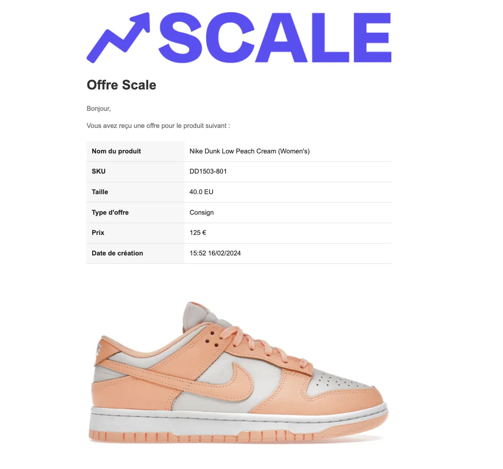
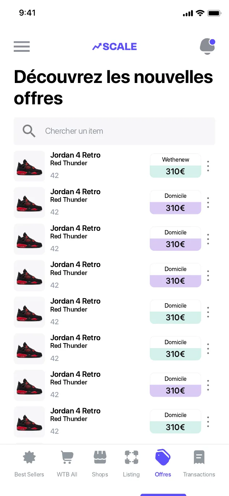

# Rachat et consignation

Scale propose deux façons de vendre une paire à un magasin.

## Le rachat

Le magasin achète la paire tout de suite.

1. Le magasin publie une demande : modèle, taille, prix.
2. Les membres qui ont la paire reçoivent une notification.
3. Le vendeur accepte l'offre : le deal est conclu.
4. Le vendeur envoie la paire avec l'étiquette fournie par Scale.
5. Le magasin reçoit la paire et vérifie son authenticité.
6. Le vendeur est payé sur son portefeuille.

## La consignation

Le magasin met la paire en vente dans sa boutique, **sans l'acheter à l'avance**. Le vendeur est payé quand la paire est vendue.

* **Pour le magasin :** il remplit ses stocks sans dépenser un euro et propose plus de paires à ses clients.
* **Pour le vendeur :** il fixe le prix qu'il souhaite recevoir. Le magasin accepte ou refuse ce prix.


**Exemple :** tu envoies une Dunk Low Black GS en 38 et tu fixes le prix de consignation à 120 €. Si le magasin accepte, il te reverse 120 € au moment où la paire est vendue en boutique.


## Ce qui est automatisé

* L'envoi des offres aux membres qui ont la paire
* La conclusion du deal
* La création de l'étiquette d'expédition
* Le suivi de la transaction jusqu'au paiement

